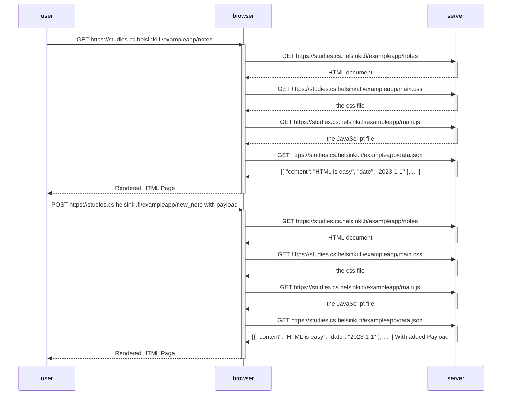

```mermaid
    sequenceDiagram
        participant user
        participant browser
        participant server

        user->>browser: GET https://studies.cs.helsinki.fi/exampleapp/notes
        activate browser
            browser->>server: GET https://studies.cs.helsinki.fi/exampleapp/notes
            activate server
            server-->>browser: HTML document
            deactivate server

            browser->>server: GET https://studies.cs.helsinki.fi/exampleapp/main.css
            activate server
            server-->>browser: the css file
            deactivate server

            browser->>server: GET https://studies.cs.helsinki.fi/exampleapp/main.js
            activate server
            server-->>browser: the JavaScript file
            deactivate server
            browser->>server: GET https://studies.cs.helsinki.fi/exampleapp/data.json
            activate server
            server-->>browser: [{ "content": "HTML is easy", "date": "2023-1-1" }, ... ]
            deactivate server
        browser-->>user: Rendered HTML Page
        deactivate browser

        user->>browser: POST https://studies.cs.helsinki.fi/exampleapp/new_note with payload
        activate browser
        browser->>server: GET https://studies.cs.helsinki.fi/exampleapp/notes
            activate server
            server-->>browser: HTML document
            deactivate server

            browser->>server: GET https://studies.cs.helsinki.fi/exampleapp/main.css
            activate server
            server-->>browser: the css file
            deactivate server

            browser->>server: GET https://studies.cs.helsinki.fi/exampleapp/main.js
            activate server
            server-->>browser: the JavaScript file
            deactivate server
            browser->>server: GET https://studies.cs.helsinki.fi/exampleapp/data.json
            activate server
            server-->>browser: [{ "content": "HTML is easy", "date": "2023-1-1" }, ..., ]  With added Payload
            deactivate server
        browser-->>user: Rendered HTML Page
        deactivate browser
```
